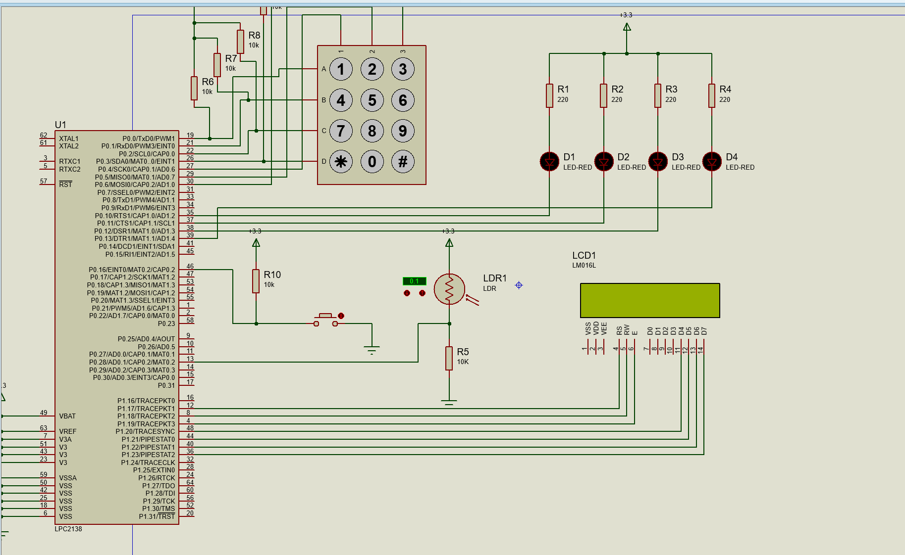
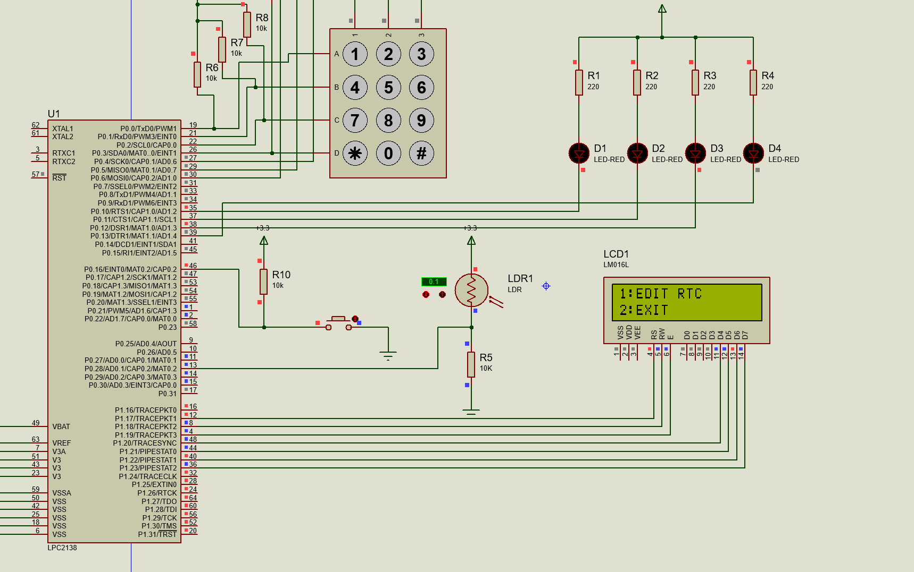
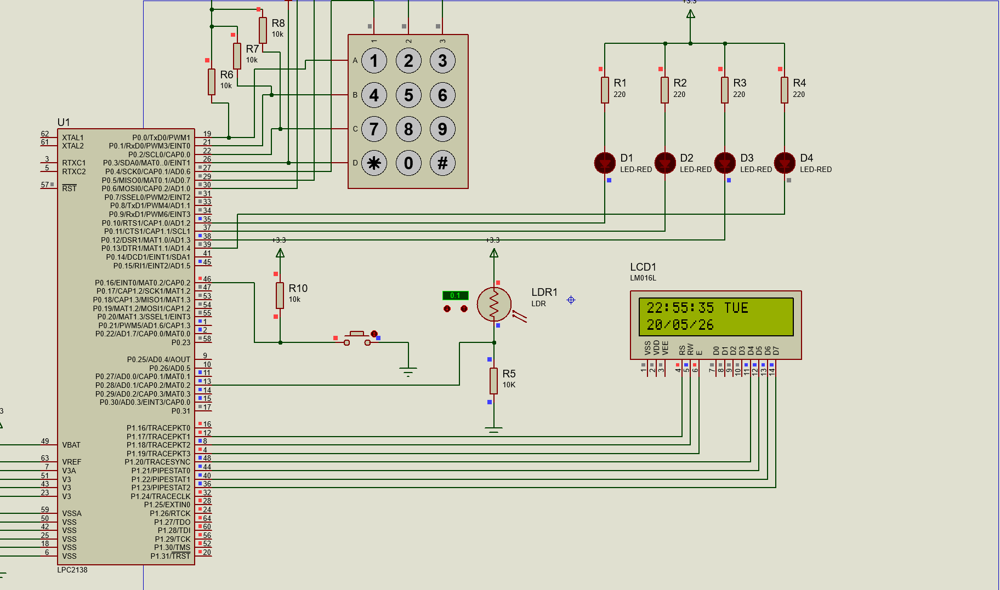

# Ecolight Maestro

## Embedded System Based Smart Lighting Control

Ecolight Maestro is an embedded system project developed using the **LPC2138 ARM7 microcontroller**. The system combines an RTC, LDR, LCD, keypad, and LEDs to provide time-based and light-based control of lighting.

The project was designed and simulated using **Embedded C, Keil µVision, and Proteus**.

---

## Features

- Real-time clock display with date and time
- RTC menu for editing time and date
- 4x3 matrix keypad for user input
- 16x2 LCD for displaying system information
- LDR-based light intensity detection
- Automatic LED control based on ambient light and time
- Four LED outputs for lighting control
- RTC interrupt-based menu operation
- Complete circuit simulation using Proteus

---

## Hardware Components

- LPC2138 ARM7 Microcontroller
- 16x2 LCD
- 4x3 Matrix Keypad
- LDR (Light Dependent Resistor)
- RTC
- 4 LEDs
- Resistors
- Push Button
- 3.3V Power Supply

---

## Software Tools

- Embedded C
- Keil µVision
- Proteus
- Git & GitHub

---

## Microcontroller

**LPC2138 ARM7TDMI-S**

The LPC2138 is used as the main controller for interfacing and controlling:

- LCD
- Keypad
- RTC
- LDR
- LEDs
- External interrupt

---

## Pin Configuration

| Peripheral | LPC2138 Pin |
|------------|-------------|
| LCD | P1.17 – P1.23 |
| Keypad | P0.0 – P0.6 |
| LDR / ADC | P0.28 (AD0.1) |
| LED 1 | P0.10 |
| LED 2 | P0.11 |
| LED 3 | P0.12 |
| LED 4 | P0.13 |
| RTC Menu Interrupt | P0.16 / EINT0 |

---

## Project Structure

```text
Ecolight_Maestro/
│
├── Source_Code/
│   ├── adc.c
│   ├── adc.h
│   ├── delay.c
|   ├── delay.h
│   ├── interrupt.c
│   ├── interrupt.h
│   ├── keypad.c
│   ├── keypad.h
│   ├── lcd.c
│   ├── lcd.h
│   ├── main.c
│   ├── rtc.c
│   └── rtc.h
│
├── Proteus/
│   └── Proteus simulation files
│
├── Images/
│   ├── Proteus_circuit.png
│   ├── normal_operation.png
│   ├── rtc_menu.png
│   ├── rtc_edit.png
│   └── updated_rtc_output.png
│
└── README.md
```

## Working Principle

The LPC2138 microcontroller reads the current time from the RTC and displays it on the LCD.

The LDR is used to detect the surrounding light intensity. Based on the lighting condition and time of day, the LEDs are controlled automatically.

The keypad allows the user to access the RTC menu and modify the time and date.

An external interrupt is used to enter the RTC menu.

## RTC Menu

The RTC menu provides options to:

1. Edit RTC
2. Exit

The RTC edit menu allows modification of:

- Hour
- Minute
- Second
- Day
- Date
- Month
- Year

## Project Screenshots

### Proteus Circuit



### Normal Operation


### RTC Menu



### RTC Edit


### Updated RTC Output



## Applications

- Automatic street-light systems
- Smart lighting systems
- Energy-efficient lighting
- Embedded automation systems
- IoT and smart-city related applications

## Conclusion

Ecolight Maestro demonstrates the integration of an ARM7 microcontroller with RTC, LCD, keypad, LDR and LEDs to implement an intelligent lighting control system with configurable date and time settings.
